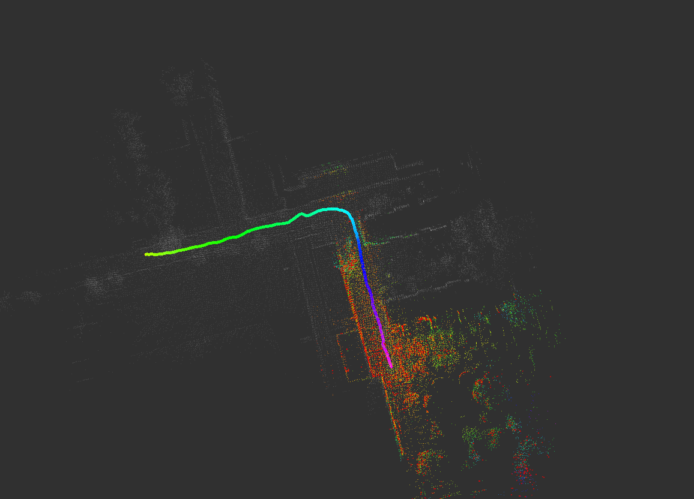
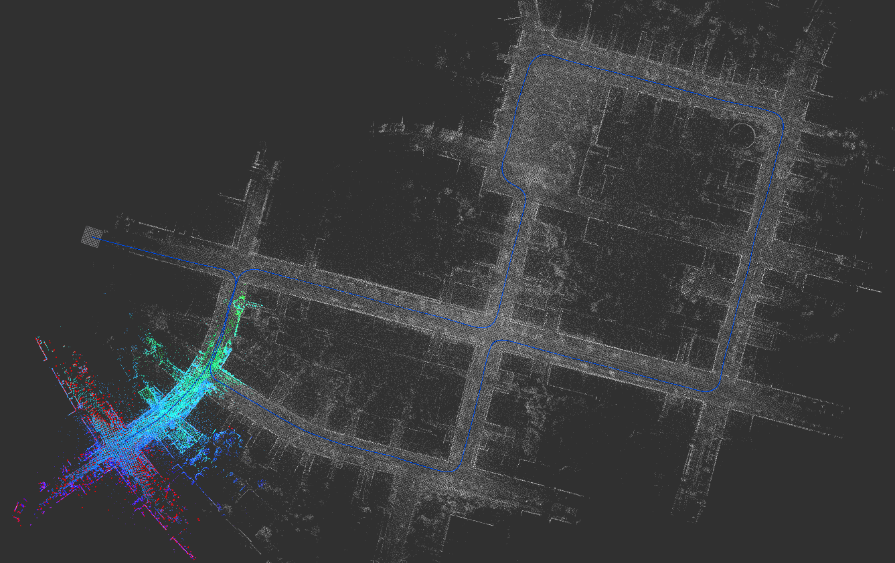
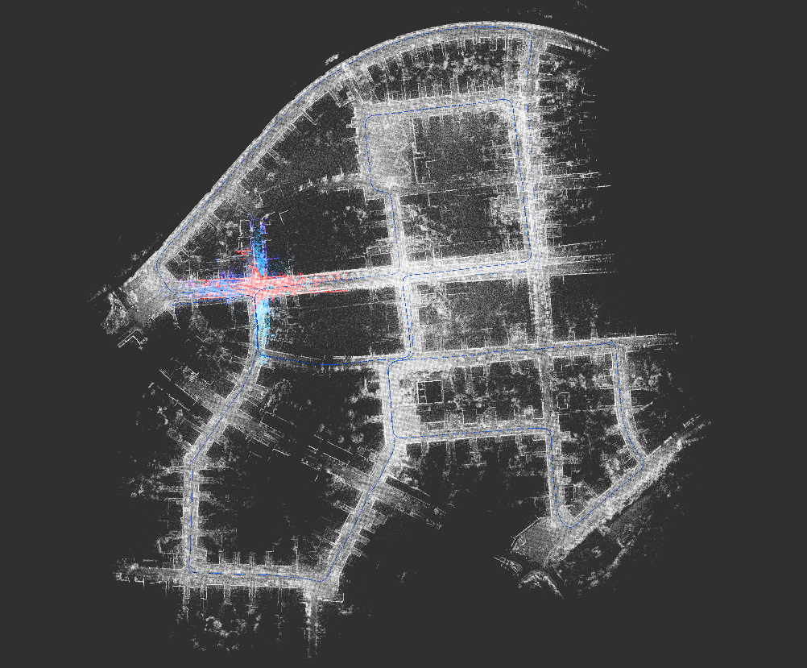

# xchu_odom
基于NDT算法的激光里程计，参考autoware、ndt_omp

## 使用

## 测试结果

kitti测试结果，全长3700m，路口基本对齐，偏移量较小。

## 更新说明

2020.10.31更新IMU支持，用于补偿连续帧的位置和姿态增量，采用匀速运动模型，以当前点云帧距离最近的imu帧作为其“匀速”。效果如图，表现比较一般，积分有问题，后续再改进。

## 其他已知问题

- 轮速计未调试好
- gpu版本ndt未调试，目前支持autoware_ndt和ndt_omp